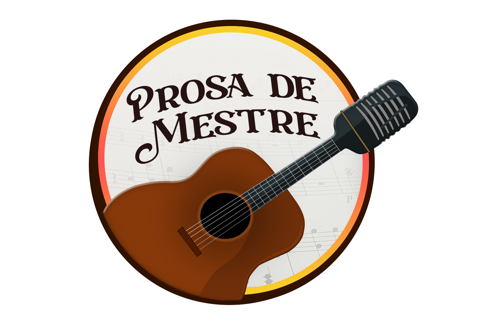

<h1 align="center">Hi, I'm Eduardo Barbosa dos Santos </h1>

  

  I'm a creative <strong>front-end developer</strong> from Burnaby, Canada, building dynamic web experiences and learning full-stack technologies along the way. Whether it's a podcast site, a manga wiki, or a data pipeline — I love bringing ideas to life.

---

## 💻 Tech Stack

 
   
   
   
  
   

---

## 🌱 Currently Learning

  
  
  
  
  

---

## 🔥 Featured Projects

<table> 
  <tr> 
    <td width="30%"> 
      

        
      

    </td> 
    <td> 
      <h3>🔗 <a href="https://github.com/EduardoEduBox/Rithual_Reader_Next">Rithual Reader</a></h3>
      A manga reading platform built with Next.js. Includes clean UI, chapter navigation, and typescript-powered routing.
    </td> 
  </tr>

  <tr><td colspan="2"> </td></tr>

  <tr> 
    <td width="30%"> 
      

        
      

    </td> 
    <td> 
      <h3>📚 <a href="https://github.com/EduardoEduBox/Rithual_Wiki_React">Rithual Wiki</a></h3>
      A React-based wiki for the worldbuilding behind my manga. Features search, expandable entries, and lore architecture. 
      🔗 <a href="https://rithual-wiki.com.br/" target="_blank">Visit Site</a>
    </td> 
  </tr>

  <tr><td colspan="2"> </td></tr>

  <tr> 
    <td width="30%"> 
      
    </td> 
    <td> 
      <h3>🎙️ <a href="https://github.com/EduardoEduBox/Prosa_de_Mestre_React">Prosa de Mestre</a></h3>
      Official site for a Brazilian repentista podcast, styled with TailwindCSS and built for responsiveness. 
      🔗 <a href="https://prosademestre.com.br/" target="_blank">Visit Site</a>
    </td> 
  </tr>

  <tr><td colspan="2"> </td></tr>

  <tr> 
    <td width="30%"> 
      

        
      

    </td> 
    <td> 
      <h3>🃏 Praça Dominó (Private Project)</h3>
      An online multiplayer domino game with a betting system. Built with real-time interactions in mind. 
      <i>Currently in private development — soon to be available for testing and play!</i> 
    </td> 
  </tr>
</table>

## 📊 GitHub Activity & Trophies

<table align="center">
  <tr>
    <td align="center" width="37%">
      
    </td>
    <td align="center" width="63%">
      
    </td>
  </tr>
  <tr>
    <td align="center" colspan="2">
      
    </td>
  </tr>
</table>

---

## 🎯 Let's Connect!

  
  &nbsp;&nbsp;&nbsp;
  
  &nbsp;&nbsp;&nbsp;
  

